# DIY-ESP32-Wireless-Walkie-Talkie-2-way-Secure-Voice-and-Messaging-support
Build your own ESP32-based Wireless Walkie-Talkie featuring two-way voice communication, secure text messaging, OLED user interface, 4×4 keypad, digital audio processing, and a custom-designed PCB.

This project was designed from the ground up as a compact handheld wireless communication device that combines **embedded systems, wireless communication, audio processing, PCB design, firmware development, and hardware debugging**.

The device can communicate directly with another unit without depending on a mobile network or internet connection.

> 📡 Designed & Developed by **Md Mizanur Rahman – ElectroSurgeon**

---

# 📸 Project Preview

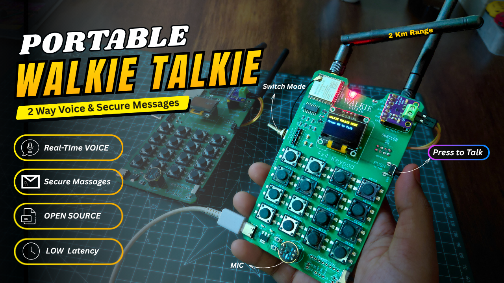

### Two Complete Walkie-Talkie Units

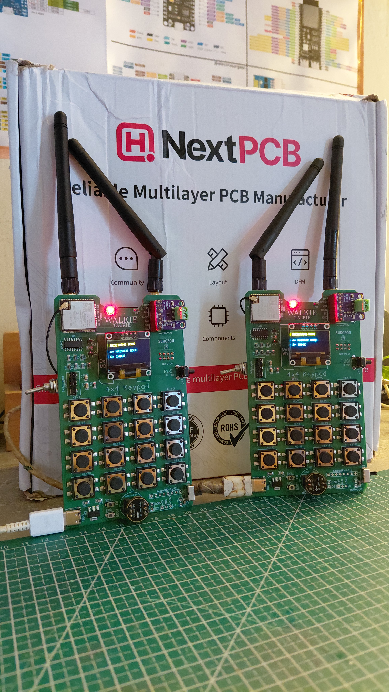

---

# 🔥 Key Features

* 📡 ESP32-based wireless communication
* 🎙️ Real-time voice communication
* 🔊 Digital audio output
* 💬 Two-way text messaging
* 🔐 Secure device-to-device communication
* 📻 nRF24L01 wireless communication
* ⌨️ 4×4 keypad for message typing and navigation
* 🖥️ OLED graphical user interface
* 🎤 Digital microphone input
* 🔈 Speaker audio output
* 🎛️ Menu-based user interface
* 🔋 Portable battery-powered operation
* 🧩 Custom-designed PCB
* 🛠️ Professional PCB Assembly
* 📶 Dual-device communication
* ⚡ Compact handheld design
* 💻 Programmable using Arduino IDE
* 🚀 Expandable firmware and hardware architecture

---

# 🧠 System Overview

The Walkie-Talkie combines multiple communication and embedded subsystems inside a single handheld device.

```text
                    ┌─────────────────────┐
                    │        ESP32        │
                    │                     │
                    │   Main Controller   │
                    └─────────┬───────────┘
                              │
          ┌───────────────────┼────────────────────┐
          │                   │                    │
          ▼                   ▼                    ▼
     ┌─────────┐        ┌───────────┐        ┌───────────┐
     │  OLED   │        │ 4×4 Keypad│        │ nRF24L01 │
     │ Display │        │           │        │ Wireless  │
     └─────────┘        └───────────┘        └───────────┘

          │
          ├─────────────────────────────────┐
          │                                 │
          ▼                                 ▼
   ┌──────────────┐                  ┌──────────────┐
   │   INMP441    │                  │  MAX98357A   │
   │ I²S Digital  │                  │ I²S Amplifier│
   │  Microphone  │                  │      +       │
   └──────────────┘                  │   Speaker    │
                                     └──────────────┘
```

---

# 🧰 Components Required

Esp32:  https://amzn.to/4vskGTW
INMP441 mic: https://amzn.to/4vlnYs1
MAX98357A: https://amzn.to/3SdJ8tD
0.96'' Oled display: https://amzn.to/4w3VyCD
4x4 keypad: https://link.amazon/B03x8EiPp
nrf24L01 module: https://link.amazon/B0j8SdGQZ
Rf antenna: https://link.amazon/B09ls1GMt
Speaker(3W):  https://amzn.to/4xFsZgA
Smd led (0805): https://link.amazon/B0fsyrHB9
Toggle Switch: https://link.amazon/B04BFqe7g
90' push switch: https://link.amazon/B041lkSXg
Sliding switch: https://link.amazon/B02VlEmuU
Battery : https://link.amazon/B01q3dqSz 


> ⚠️ Check the exact module versions and component footprints used in the PCB before ordering.

---

# 🎙️ Audio System

The audio section is built using digital I²S audio components.

### 🎤 INMP441 Digital Microphone

The **INMP441** is used for capturing voice.

It communicates directly with the ESP32 through the **I²S digital audio interface**, reducing the need for an external analog ADC/audio codec.

### 🔊 MAX98357A Audio Amplifier

Received digital audio is sent from the ESP32 to the **MAX98357A I²S Class-D amplifier**.

The amplifier drives the speaker and provides clear audio output from the remote walkie-talkie.

```text
VOICE TRANSMISSION

Voice
  │
  ▼
INMP441
  │
  │ I²S
  ▼
ESP32
  │
  │ Wireless
  ▼
ESP32
  │
  │ I²S
  ▼
MAX98357A
  │
  ▼
Speaker
```

---

# 💬 Messaging System

The device also supports **two-way text messaging**.

Messages can be entered using the **4×4 keypad**, displayed on the OLED, and transmitted wirelessly to the second device.

```text
4×4 Keypad
     │
     ▼
   ESP32
     │
     ▼
 Wireless Link
     │
     ▼
   ESP32
     │
     ▼
 OLED Display
```

This allows the Walkie-Talkie to operate as both a:

* 🎙️ Voice communicator
* 💬 Portable text messenger

---

# ⌨️ 4×4 Keypad

The keypad is used for:

* Menu navigation
* Message typing
* Selecting characters
* Opening communication modes
* Confirming commands
* Device control

A mobile-phone-style **T9 / multi-tap text entry system** can be implemented for message typing.

Example:

```text
1 → , . ? ! 1
2 → A B C 2
3 → D E F 3 
4 → G H I 4
5 → J K L 5
6 → M N O 6
7 → P Q R S 7
8 → T U V 8
9 → W X Y Z 9
0 → 0 and Space
A → Message mode
B → INBOX
C → Scroll Up
D → Scroll Down
```

---

# 🖥️ OLED User Interface

The OLED provides a compact graphical interface for the Walkie-Talkie.

The display can show:
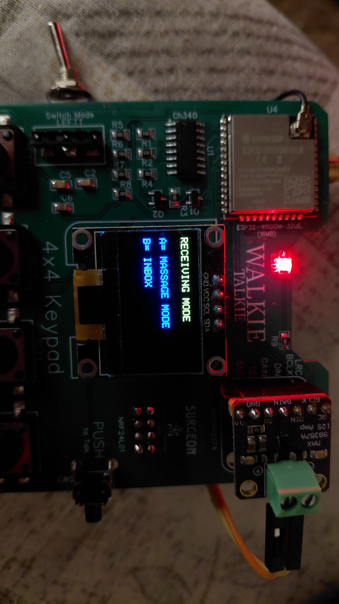
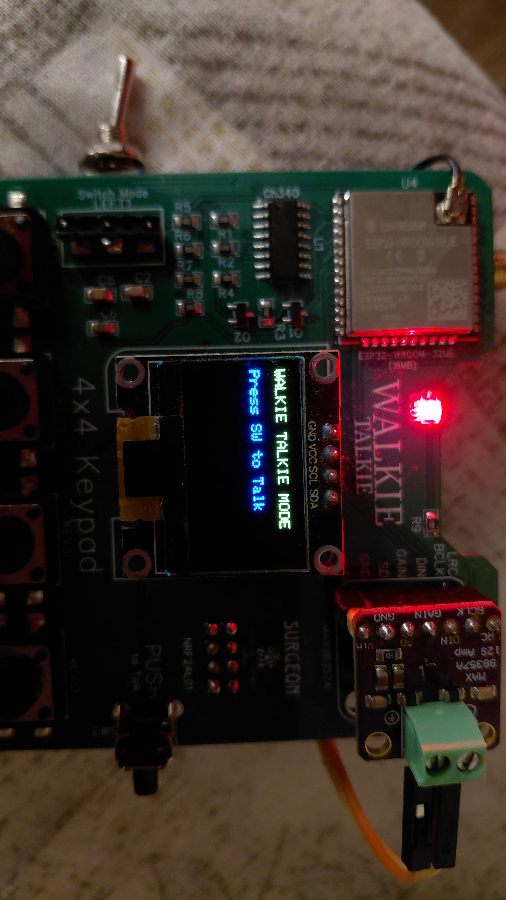
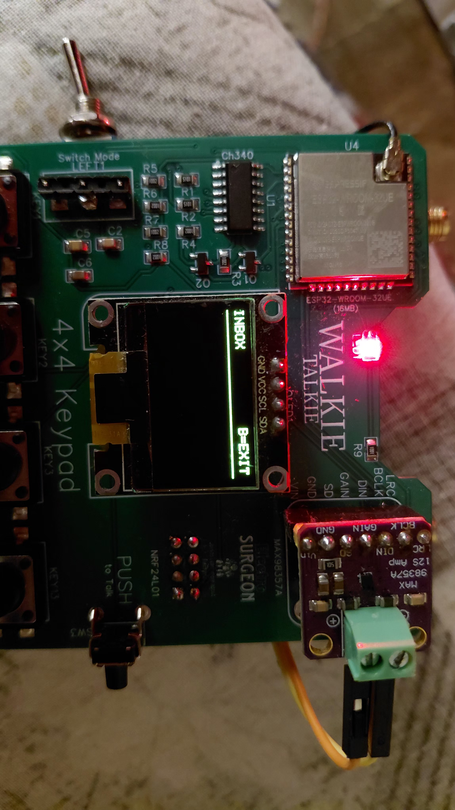
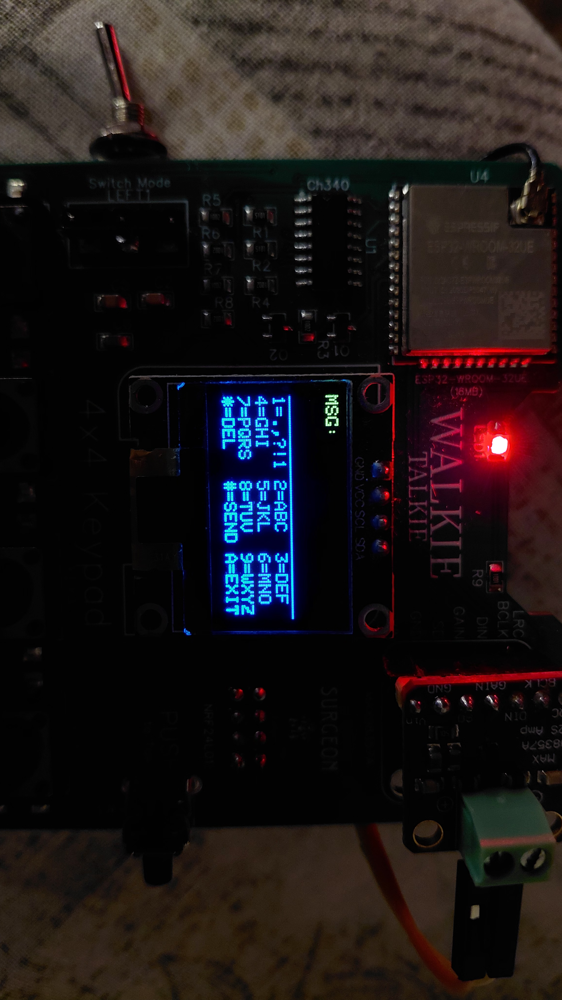
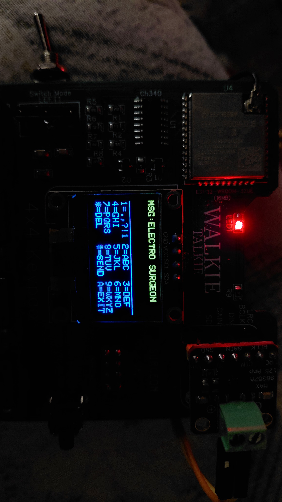


---
# 🔌 Schematic Diagram

The complete schematic for the project is provided below.

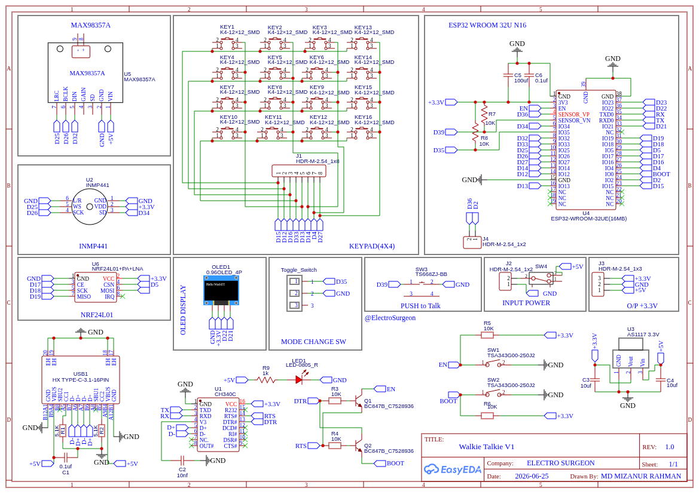

The schematic includes:

* ESP32
* Wireless communication section
* nRF24L01
* OLED display
* 4×4 keypad
* Digital microphone
* Audio amplifier
* Speaker
* Push buttons
* Power supply
* Battery interface
* Supporting passive components

---

# 🖥️ PCB Design

Instead of building the entire circuit using jumper wires, I designed a **custom PCB** for the Walkie-Talkie.

The PCB integrates the major electronic modules and connections into a compact and reliable handheld platform.

---

# 🟢 PCB 2D View –

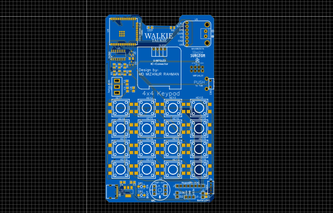


---

# 🔥 PCB 3D View

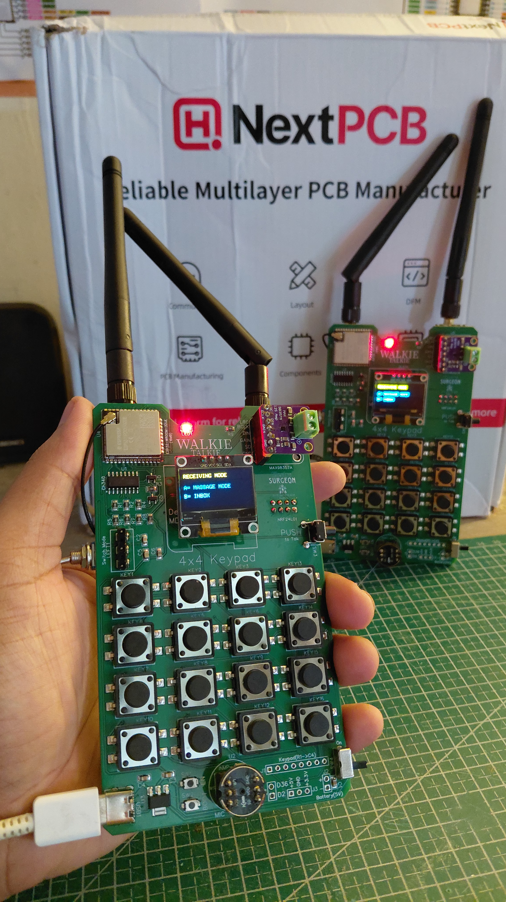

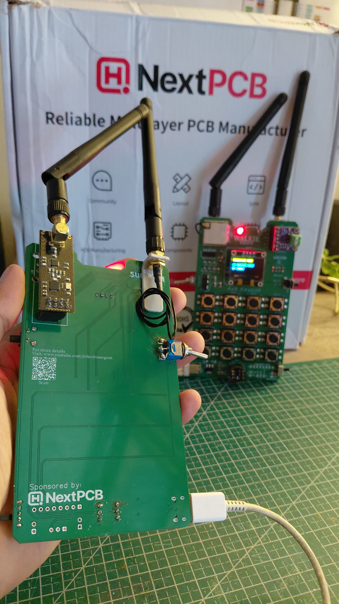

---

# 🏭 PCB Manufacturing

The PCB was professionally manufactured by **NextPCB**.

The complete hardware development process included:

```text
Idea
 ↓
Circuit Design
 ↓
Schematic
 ↓
PCB Layout
 ↓
Gerber Generation
 ↓
PCB Manufacturing
 ↓
PCB Assembly
 ↓
Firmware Development
 ↓
Testing
 ↓
Debugging
 ↓
Final Prototype
```

---

# 🤝 Sponsored by NextPCB

This project is proudly supported by **NextPCB** ❤️

I used NextPCB for the manufacturing and professional assembly of my custom Walkie-Talkie PCB.

The PCB quality, precise fabrication, professional assembly, and overall manufacturing support helped transform the design from a PCB layout into a fully functional hardware prototype.

### 🏭 Order Your Custom PCB

👉 [NextPCB Official Website](https://www.nextpcb.com/?code=ElectroSurgeon)


NextPCB provides services including:

* PCB Manufacturing
* PCB Assembly
* SMD Assembly
* Through-Hole Assembly
* Prototype PCB
* Multilayer PCB
* PCB Design Verification
* Gerber File Viewer
* Component Sourcing

A huge **THANK YOU to NextPCB** for supporting this project! ❤️🔥

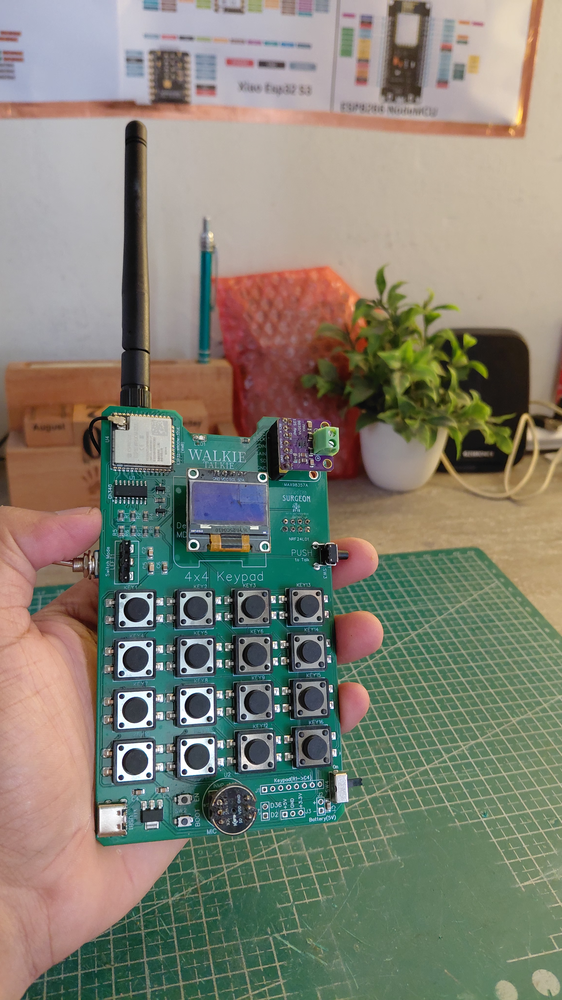
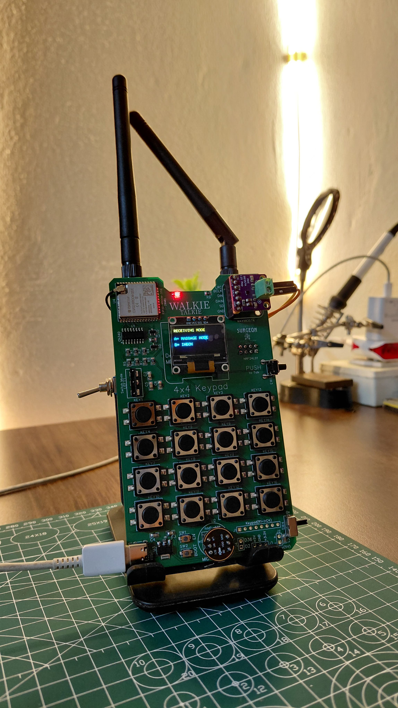
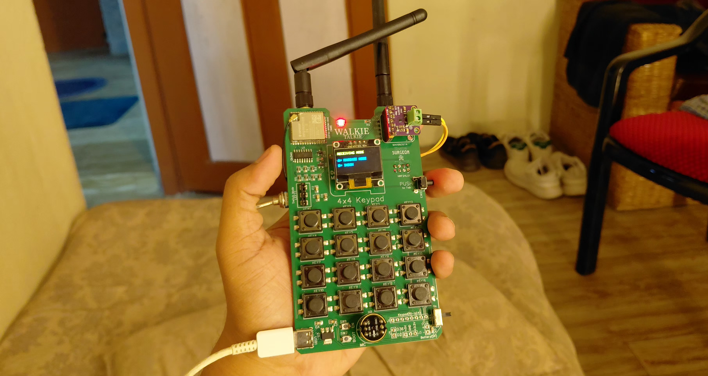
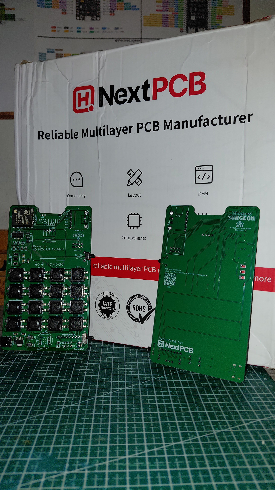
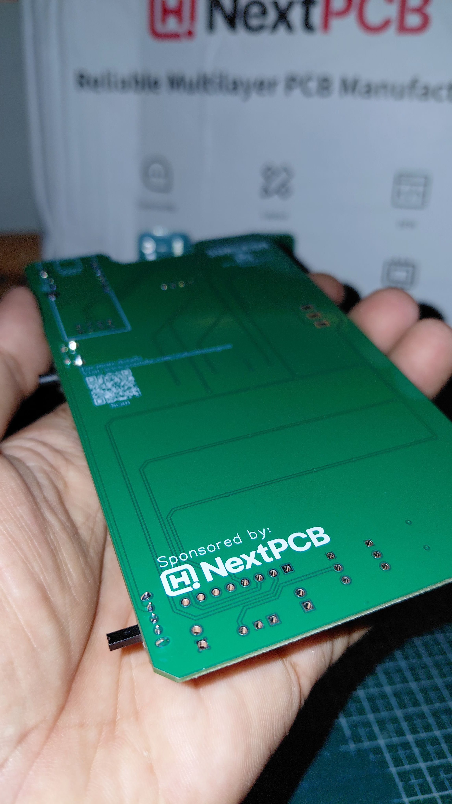
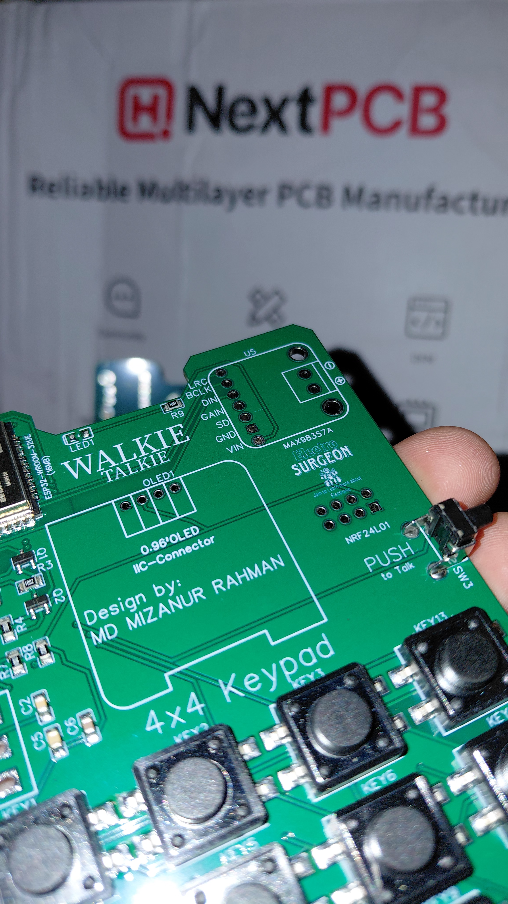
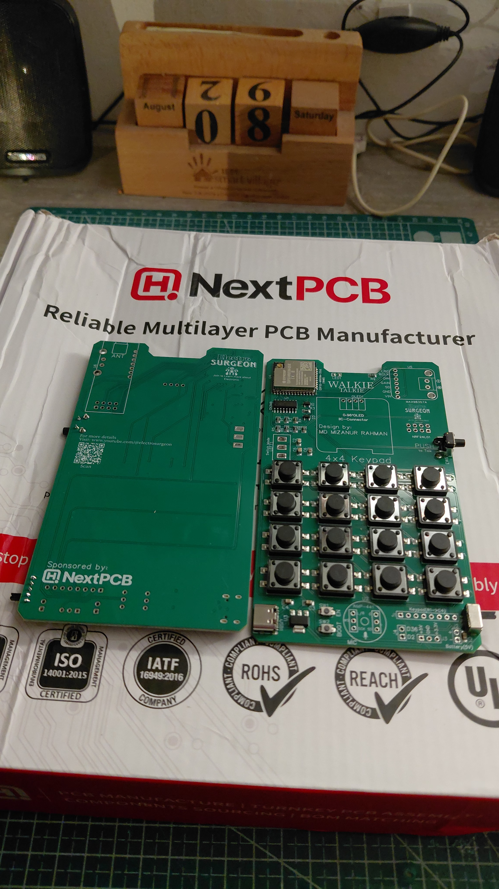

---


# 📡 How It Works

### Voice Mode

1. Select **Walkie Talkie / Voice Mode**.
2. Press the PTT / communication button.
3. Voice is captured by the microphone.
4. ESP32 processes the digital audio.
5. Audio data is transmitted wirelessly.
6. The receiving ESP32 reconstructs the audio.
7. MAX98357A drives the speaker.
8. The remote user hears the voice.

### Message Mode

1. Open **Messages** from the menu.
2. Enter text using the 4×4 keypad.
3. Confirm the message.
4. ESP32 sends the data wirelessly.
5. The receiving device displays the message on its OLED.

---

# 🎯 Applications

This project can be used for:

* 🚨 Emergency and disaster communication
* 🏕️ Remote/off-grid communication
* 🏔️ Hiking and outdoor communication
* 🎪 Event communication
* 🏫 Campus communication
* 👷 Team coordination
* 🛠️ Field monitoring
* 🤖 Robotics projects
* 🚗 RC applications
* 🏭 Industrial communication experiments
* 📡 Areas where cellular networks are unavailable
* 🎓 Wireless communication education
* 🎓 Embedded systems learning
* 🔬 Research and prototyping

---

# 🔥 Future Upgrades

The hardware and firmware architecture can be expanded further.

Planned / possible upgrades include:

* 📍 GPS tracking
* 🗺️ Location sharing between devices
* 🆘 SOS emergency alerts
* 👥 Multi-device group communication
* 🔐 Advanced encrypted communication
* 🌡️ Wireless sensor data transmission
* 🧭 Digital compass
* 🛰️ GPS navigation
* 💾 microSD card message storage
* 📜 Communication logs
* 📂 Configuration storage
* 🔋 Advanced battery monitoring
* 📊 RSSI / signal strength indicator
* 🔔 Message notification system
* 📇 Contact list
* 💬 Message history
* 📡 Multiple wireless channels
* 🎙️ Improved audio compression
* 🔊 Volume control
* 🌙 OLED dark / sleep mode
* 🔌 USB-C charging
* 🖥️ Improved graphical UI
* 📱 Smartphone configuration interface
* 🌐 Wi-Fi configuration dashboard
* 🔄 OTA firmware updates

---

# 🎥 Project Tutorial

## ▶️ Full Video Tutorial

[](https://youtu.be/oKskIdD0tRI)

**Full tutorial coming / available on ElectroSurgeon YouTube Channel.**

---

# 🌐 Connect With Me

### 👨‍💻 Designed & Developed by Md Mizanur Rahman

**ElectroSurgeon**

🌐 Website
https://sites.google.com/view/electrosurgeon

📸 Instagram
https://www.instagram.com/electro_surgeon/

▶️ YouTube
https://www.youtube.com/@electrosurgeon

💼 LinkedIn
https://www.linkedin.com/in/md-mizanur-rahman-0990bb322/

---

# ❤️ Support This Project

If you found this project useful:

⭐ **Star this Repository**

🍴 **Fork the Repository**

📢 **Share it with other makers**

▶️ **Subscribe to ElectroSurgeon**

Your support motivates me to build and share more electronics, embedded systems, IoT, PCB, and ESP32 projects.

---

# ⚠️ Disclaimer

This project is intended for **educational, research, prototyping, and legal communication applications**.

Wireless communication regulations vary by country. Make sure the frequencies, power levels, and communication methods used in your hardware comply with your local regulations.

---

# 📜 License

This project is released for educational and personal development purposes.

Please provide appropriate credit to **Md Mizanur Rahman / ElectroSurgeon** if you use or modify this project.

---

## ⭐ Don't Just Learn Technology. Build It.

### — ElectroSurgeon ⚡
